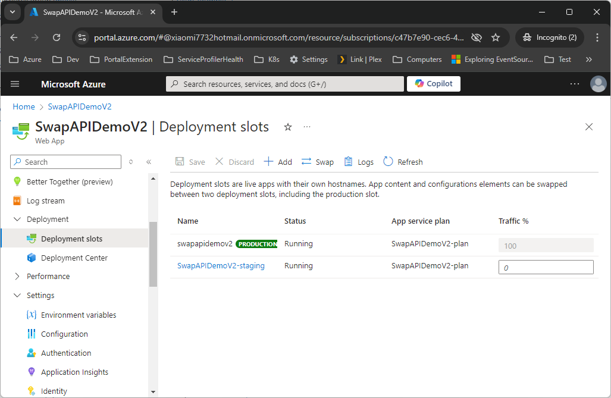

# Deploying a .NET 8 Application to an Azure App Service Slot with ARM Templates: A Step-by-Step Guide

In my previous post, we explored how to deploy a .NET 8 application to an Azure App Service using ARM templates. If you missed it, you can catch up [here](./Readme.md). Today, we’ll advance by deploying an application to a specific slot within the App Service.

Deploying to a slot provides a staging environment to test new versions of your app before moving them to production. In the next post, we’ll cover how to swap this staging slot with the production environment using ARM templates.

For those who prefer to dive directly into the template, you can view it [here](./ARM/staging-slot.json).

## Prerequisites

Ensure you have an existing App Service deployed. We will deploy a new version of the application to a slot, such as a staging slot, as shown below:



## Steps

1. **Prepare the Application**

   Refer to [Prepare the Application](./Readme.md#prerequisite) to build and upload the application. Update the source code to output a text like `Hello World! v2` and upload the `v2.zip` package to blob storage:

   ```
   https://xm7732public.blob.core.windows.net/public/arm-swap-examples/v2.zip
   ```

2. **Create an ARM Template for the Staging Slot**

   Use the following ARM template to create an empty staging slot:

   ```jsonc
   {
     "type": "Microsoft.Web/sites/slots",
     "apiVersion": "2018-02-01",
     "name": "[concat(parameters('siteName'), '/', parameters('slotName'))]",
     "location": "[variables('location')]",
     "properties": {}
   }
   ```

   Note: Ensure the `name` property is in the format `siteName/slotName` and that the site name is correct.

3. **Deploy the Application Package Using the `onedeploy` Extension**

   Add the following configuration to deploy the application package:

   ```jsonc
   {
     "type": "Extensions",
     "apiVersion": "2022-09-01",
     "name": "onedeploy",
     "properties": {
       "packageUri": "https://xm7732public.blob.core.windows.net/public/arm-swap-examples/v2.zip",
       "type": "zip"
     },
     "dependsOn": [
       "[concat('Microsoft.Web/sites/', parameters('siteName'), '/slots/', parameters('slotName'))]"
     ]
   }
   ```

   The key here is to correctly declare the dependency on the slot resource.

4. **Deploy the ARM Template**

   Deploy the ARM template using the following PowerShell commands:

   ```powershell
   # Log in to Azure
   az login

   # Set your subscription (if needed)
   az account set -s 'Your Subscription Name'

   # Define the resource group name
   $rgName = "my-dotnet8-app-demo"

   # Start the deployment
   az deployment group create -n manual-deploy -g $rgName --template-file .\staging-slot.json
   ```

## Conclusion

By following these steps, you’ve successfully deployed your .NET 8 application to a staging slot in Azure App Service. This approach allows you to test new versions of your app in an isolated environment before they go live. In the [next post](./SwapSlot.md), we'll dive into how to swap the staging slot with the production environment using ARM templates, completing the deployment workflow.

Feel free to leave any questions or comments by using the issues. Star this repo if you like the content.